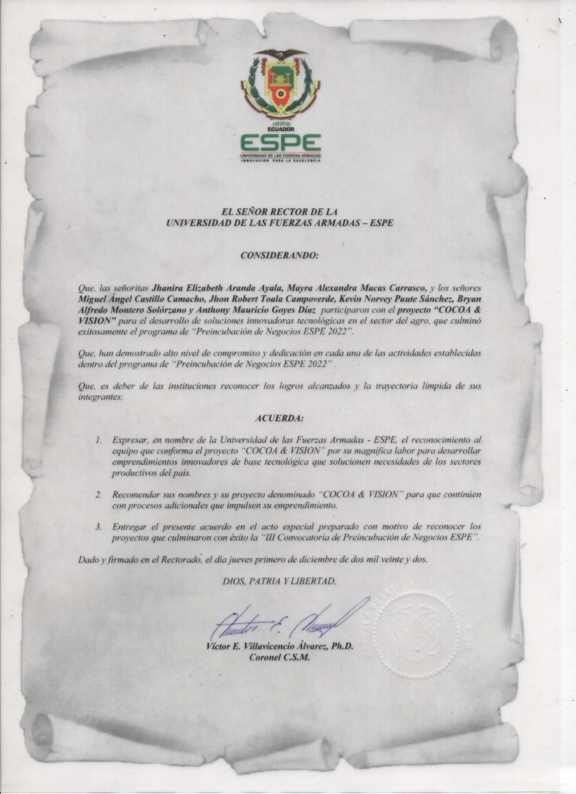

# Introducción
Este repositorio contiene los scripts del proyecto "Cocoa Vision". Fuí el encargado de desarrollar los modelos de ML y DL para la detección de monilia (Moniliophthora roreri) en mazorcas de cacao, la cual es una enfermedad muy grave en estos cultivos. Básicamente, el modelo clasifica si una planta se encuentra con monilia y si está sana o en buen estado. Para ello, se utilizó un conjunto de datos privado desarrollado por miembros del equipo de trabajo. Se utilizaron diferentes técnicas hasta llegar con las mejores para la continuidad del proyecto. 
# Contenido
* **1_Preprocesamiento_img**: este directorio contiene la fase de preprocesamiento de imágenes de cacao. Las actividades realizadas fueron generar nuevas imágenes (data aumentation), redimensionar, eliminar el fondo de las imágenes y sacar el ruido.
* **2_extraccion_caracteristicas**: en el archivo Colores_dataset.ipynb se extraen los vectores de características por escala de colores. En cambio, en el archivo Textura_dataset.ipynb se extrae la textura superficial de las imágenes de cacao. Ambas características se guardan en archivos de datos h5.
* **ML** : se utiliza el modelo SVM, aunque no es necesario utilizar la técnica OvO se utilizó ya que en base a hiperparámetros se obtuvo se mejoró el modelo. 
* **DL** : se utiliza Inception_v3 y MobileNetV2, con ambos modelos se obtuvieron resultados muy prometedores para la continuidad del proyecto.

## Librerías utilizadas
* Numpy
* OpenCV
* Tensorflow
* Keras
* Rembg
* Scikit-learn
* h5py
* Mahotas
* Seaborn

### Reconocimiento del proyecto
 
***Figura 1***: Reconocimiento de proyecto "Cocoa Vision" por parte de la Universidad de las Fuerzas Armadas ESPE.